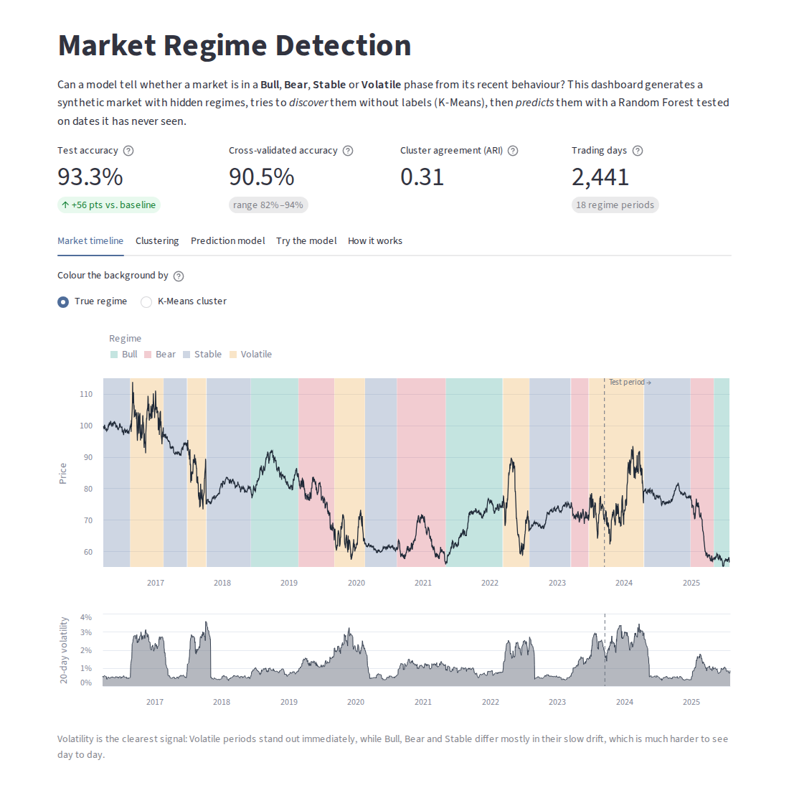

# Financial Market Regime Detection & Prediction

An end-to-end data science project that identifies market regimes (**Bull, Bear, Stable, Volatile**) in daily market data, first **without labels** (K-Means clustering) and then **with a supervised model** (Random Forest) evaluated on dates it has never seen. It includes an interactive dashboard.

**Live dashboard:** _link added after deployment_



The project uses **synthetic market data** with known hidden regimes, so every method can be checked against the ground truth, and nothing proprietary or personal is shared.

## Results (default dataset, seed 42)

| What | Result |
|---|---|
| Random Forest, test on newest 20% of dates (489 days) | **93.3%** accuracy, macro F1 0.90 |
| Baseline: always guess the most common regime | 37.0% |
| Purged 5-fold time-series cross-validation | **90.5%** mean accuracy (range 82–94%) |
| K-Means vs true regimes (adjusted Rand index) | **0.31** (1 = perfect, 0 = random) |

**Across five different synthetic datasets** (seeds 1, 7, 42, 123, 2024), cross-validated accuracy ranges from **79% to 91%** (mean 84%). Test accuracy on the final 20% ranges from 48% to 93%. The 48% case is instructive: in that dataset the training period contains no Volatile days at all, so the model can't recognise them when they appear. The dashboard warns when this happens.

### What the results show

- **Volatility is the dominant signal.** Volatile periods are detected almost perfectly, with or without labels.
- **K-Means finds real structure but not all four regimes.** It isolates turbulent and falling markets, but Bull and Stable land in the same calm cluster because they differ only by a tiny daily drift (about 0.07% vs 0.01%).
- **The Random Forest separates all four** on unseen dates. Most errors happen in the first weeks after a regime change, while the rolling windows still reflect the previous regime.
- **Evaluation design matters.** A random shuffle split on the same data scores 97.3%, because neighbouring days share almost all of their rolling-window data. A time-ordered split gives the honest number.

## Features

All features look only backwards in time.

| Feature | Meaning |
|---|---|
| `rolling_mean_20`, `rolling_mean_60` | Average daily return over the last 20 / 60 trading days (trend) |
| `rolling_volatility_20`, `rolling_volatility_60` | Standard deviation of daily returns over 20 / 60 days (risk) |
| `momentum_20` | Price change over the last 20 days |
| `relative_volume_20` | 20-day average volume divided by the long-run median volume so far |

K-Means uses a slower subset (60-day trend, 20-day volatility, momentum, relative volume) so clusters describe market conditions rather than single-day noise.

## Workflow

```text
Synthetic market data (2,500 days, 4 hidden regimes, 25 missing volume values)
        ↓
Cleaning (sort, de-duplicate, forward-fill missing volume)
        ↓
Feature engineering (backward-looking rolling windows)
        ↓
K-Means clustering  →  compared with true regimes (crosstab, adjusted Rand index)
        ↓
Random Forest  →  time-ordered train/test split + purged time-series cross-validation
        ↓
Interactive Streamlit dashboard
```

## Project structure

```text
app.py                      Streamlit dashboard
render.yaml                 Render deployment config
src/
  config.py                 Paths, seed, colours
  generate_data.py          Synthetic data generator
  data_preprocessing.py     Cleaning
  feature_engineering.py    Features
  clustering.py             K-Means + cluster profiling and scoring
  prediction.py             Random Forest training and evaluation
  evaluation.py             Time split, purged CV, metrics
  pipeline.py               Runs everything in one call (used by the app and notebook)
notebooks/
  market_regime_analysis.ipynb   Full analysis with charts and outputs
visualizations/             Charts written by the scripts
docs/                       README images
```

## How to run

```bash
git clone https://github.com/ashishhh2005/financial-market-regime-detection.git
cd financial-market-regime-detection
python -m venv .venv
source .venv/bin/activate        # Windows: .venv\Scripts\activate
pip install -r requirements.txt
```

Run the pipeline step by step (works from any folder):

```bash
python src/generate_data.py      # creates data/market_data.csv
python src/clustering.py         # cluster profiles, comparison with truth, visualizations/market_regimes.png
python src/prediction.py         # time-split evaluation, cross-validation, saves models/regime_classifier.joblib
```

Launch the dashboard:

```bash
streamlit run app.py
```

Open the notebook:

```bash
pip install -r requirements-dev.txt
jupyter notebook notebooks/market_regime_analysis.ipynb
```

## Deployment

The dashboard runs on [Render](https://render.com) using `render.yaml`:

- **Build:** `pip install -r requirements.txt && python src/pipeline.py` (precomputes the default results so the first page load is fast)
- **Start:** `streamlit run app.py --server.port $PORT --server.address 0.0.0.0`
- **Python:** 3.11

On Render's free plan the app sleeps after 15 minutes without visitors, so the first visit after that takes about a minute to wake up.

## Limitations

- The data is synthetic, so regimes switch more cleanly than in real markets.
- Rolling windows make the model react to a regime change with a delay of a few weeks.
- Real markets have no ground-truth regime labels, so only the unsupervised part applies directly to real data.

## Tech stack

Python, pandas, NumPy, scikit-learn, Matplotlib, Altair, Streamlit, Joblib, Jupyter, Render

## Important note

This is an educational portfolio project. It is **not an investment strategy and should not be used for financial decisions**.
